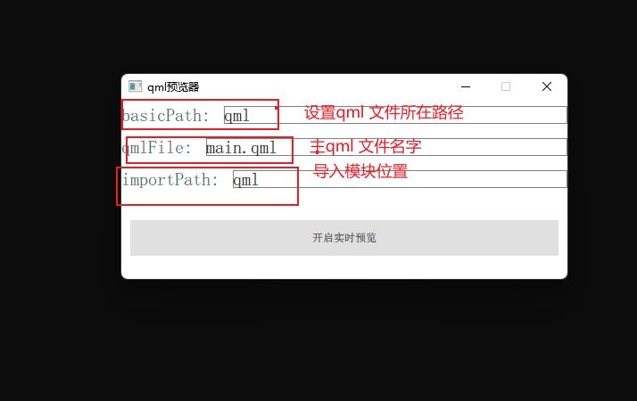
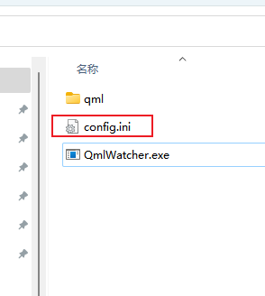
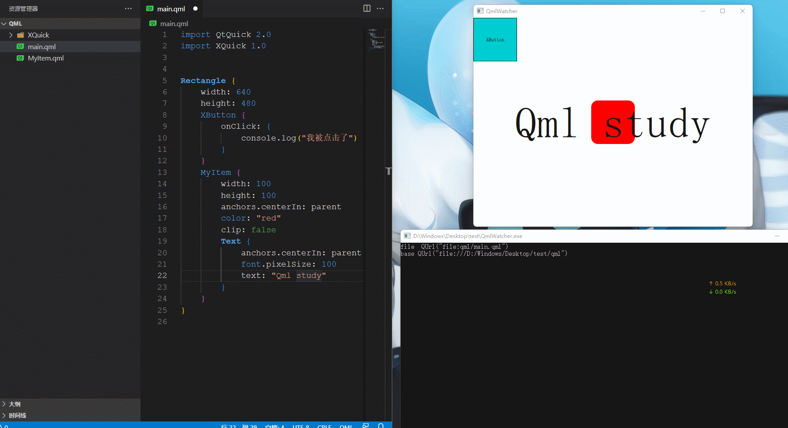

## qml 实时预览器

### 简介

由于Qt 没有提供qml实时预览的功能，没办法只能写一个类似功能的程序。
B站演示视频：https://www.bilibili.com/video/BV19u41167eJ/?spm_id_from=333.788
- [x] 动态加载qml
- [x] 相对路径加载qml文件，js文件，图片

**注意： 采取QQuickView 实现，不支持Window，可以采取Rectangle 代替**

原理：使用QFileSystemWatcher 实时监测文件是否修改

大伙可以根据自己的需要修改代码。

### 如何使用

需要设置 三个路径

1. basicPath:  qml 文件所在的路径（相对路径就从这里出发）
2. qmlFile : 在basicpath 所在路径下的主qml文件
3. importPath: 自定义模块位置

这里可以填写相对exe的相对路径或者绝对路径

为了方便用户，每次都要设置一边，程序运行的时候会将者三个设置保存为ini文件在exe路径，大伙也可以直接设置这个文件

然后开启预览，当前窗口直接会隐藏，出来一个新窗口预览qml.

关闭预览窗口，设置窗口就会再次出现，cmd窗口输出调式信息。

## 杂谈

这仅仅是一个demo, 设置我也是用qml写的，别人的qml很好看，我的qml就很丑