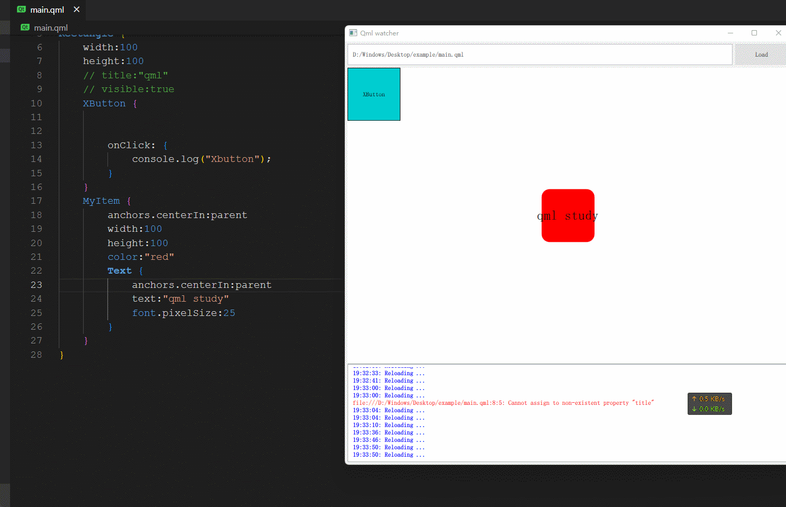

## qml 实时预览器

> 之前的代码全部推导重写了，后续在这个基础上完善的代码https://gitee.com/maoruimas/qmlliveloader

### 简介

由于Qt 没有提供qml实时预览的功能，没办法只能写一个类似功能的程序。
B站演示视频：https://www.bilibili.com/video/BV19u41167eJ/?spm_id_from=333.788

- [x] 动态加载qml
- [x] 相对路径加载qml文件，js文件，图片
- [x] 支持window和item

原理：使用QFileSystemWatcher 实时监测文件是否修改

### 如何使用

自行编译后，见gif  ,拖动到 窗口内开启预览。

